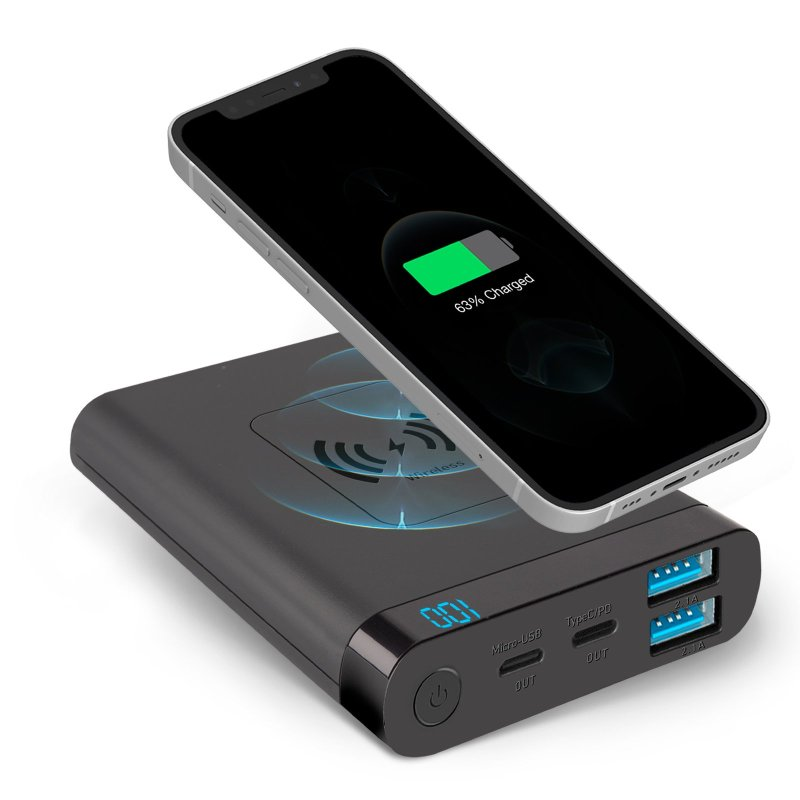

+++
title = "Unser Startup PowerBag"
date = "2022-09-13"
draft = false
pinned = false
image = "cp-11.jpg"
description = "!POWERBAG!\n\nWer sind wir? Was Verkaufen wir? Was sind unsere nächsten Schritte?"
+++
Leandro, Theo und ich haben im WEB Unterricht ein Startup namens **PowerBag** gegründet. Nämlich verkaufen wir Umhängetaschen, welche eine Power Bank integriert haben. Da die Umhängetaschen zurzeit sehr gut bei Jugendlichen ankommen, sind diese genau unsere Zielgruppe. 

Am Anfang hatten wir sehr mühe ein passender Name für unser Unternehmen zu finden, da wir viel zu weit überlegt haben. Schlussendlich haben wir uns entschieden ein ganz simpler Name zu wählen. POWERBAG.

Wir bieten verschiedene Grössen und Designs an. Eine Umhängetasche für Männer und Frauen. Wir sind ein dynamisches und junges Team mit vielen Ideen.  

Unser nächster Schritt wird die Vermarktung unseres Produktes sein. Wir wollen verschiedene Social Media Accounts erstellen, um unser Produkt bestmöglich zu vermarkten sowie Verkaufen. Ebenso hatten wir die Idee eine VPN zu installieren um unser Produkt in verschiedenen Länder zu vermarkten. Wenn wir beispielsweise ein TikTok „in Amerika“ posten und es viral geht erreichen wir eine sehr grosse Reichweite und wahrscheinlich auch mehr Verkäufe da die USA Konsumfreudiger als Europa ist.

Wir sind zurzeit sehr hart für unser Projekt am arbeiten, da wir noch vieles abzuklären haben.

Wir Freuen uns wohin dieses Projekt uns führt und sind gespannt wie es weitergeht :)